# Orion-Dynamic

Orchestrateur de Ressources à Inventaire Dynamique et Gestion de Baux

## Objectif

Simuler une plateforme PaaS où les ressources (conteneurs/machines) **s'enregistrent automatiquement** auprès d'un Control Plane.  
L'orchestrateur gère :

- Les locations à durée déterminée (baux)
- La QoS avec migration automatique en cas de panne
- Le nettoyage des ressources à l'expiration des baux

---

## 🔹 Architecture

### Control Plane

- **Reverse Proxy (Caddy)** : HTTPS pour les clients, HTTP pour les agents. Fait du **Load Balancing** dynamique vers les réplicas d'API.
- **API Python** : Gère l’enregistrement des Workers et les locations. Scalable horizontalement (replicas gérés par l'autoscaler).
- **Autoscaler** : Service autonome qui monitore la charge CPU des conteneurs API via le socket Docker et ajuste le nombre de répliques (Scale Up/Down).
- **Scheduler** : Service scalable (supporte le multi-instance grâce au verrouillage `SKIP LOCKED`). Gère Health Check, migration et expiration.
- **MariaDB** : Base de données centralisée (Inventaire, Locations, Users).

### Data Plane

- **Workers** : Conteneurs ou machines simulées, avec SSH et un agent d’enregistrement (`agent.py`).

---

## Flowchart



## Fonctionnalités

### Agent (`agent.py`)

- Lit les variables d’environnement (`MY_HOST_PORT`, `API_ENDPOINT`)
- Enregistre le Worker via `POST /api/workers/register`
- Réessaye en boucle si le Control Plane n’est pas prêt
- Envoie `hostname`, `ip`, et `ssh_port`

### API

- **POST /api/workers/register** : enregistre ou met à jour un Worker
- **POST /api/rent** : loue un ou plusieurs Workers pour une durée définie
  - Retourne les infos SSH pour le client
  - Marque `allocated = true` dans la base de données

### Scheduler

- **Health Check** : ping SSH tous les Workers
- **Migration** : déplace les clients d’un Worker mort vers un Worker sain
- **Expiration des baux** : déprovisionne et libère automatiquement les Workers

---

## Déploiement

1. **Control Plane**

```bash
docker-compose up -d
```
2. **Workers (Data Plane)**

```bash
./launch_workers.sh
```
3. Agent

- Se lance automatiquement au démarrage du Worker
- Lit les variables d’environnement (`MY_HOST_PORT`, `API_ENDPOINT`)
- Enregistre le Worker auprès du Control Plane via `POST /api/workers/register`
- Gère les réessais en cas d’échec
- Envoie `hostname`, `ip`, et `ssh_port`

## Fichiers importants

- `docker-compose.yml` : orchestration Control Plane
- `Dockerfile` pour API et Scheduler
- `Dockerfile` pour Workers (Alpine + SSH + Agent)
- `control-plane/autoscaler/` : Code et Dockerfile de l'autoscaler
- `Caddyfile` : configuration du Reverse Proxy
- `init.sql` : initialisation de la base MariaDB
- `playbooks/` : Ansible pour `create_user.yml` et `delete_user.yml`
- `launch_workers.sh` : script pour déployer plusieurs Workers

## 🚀 Démonstration Complète (`full_demo.sh`)

Le projet inclut un script de démonstration complet qui joue un scénario réaliste couvrant toutes les fonctionnalités :

1.  **Cleanup** : Nettoie l'environnement.
2.  **Infrastructure** : Démarre le Control Plane et attend que l'API soit prête.
3.  **Scaling & Load Balancing** :
    *   Scale l'API et le Scheduler à 3 réplicas.
    *   Démontre le Round-Robin du Load Balancer.
4.  **Authentification & Rôles** :
    *   Crée un Admin et un User.
    *   Vérifie les connexions et les tokens JWT.
5.  **Location & Self-Healing** :
    *   L'utilisateur loue un nœud.
    *   **Simulation de panne** : Le worker loué est arrêté brutalement.
    *   **Migration** : Le Scheduler détecte la pane et migre l'utilisateur vers un nouveau nœud automatiquement.
    *   **Resurrection** : Le worker mort est redémarré.
    *   **Cleanup de sécurité** : Le Scheduler détecte le retour du worker et supprime immédiatement le compte utilisateur qui y était (pour éviter tout accès non autorisé).
6.  **Cycle de vie** :
    *   Location -> Extension de bail -> Libération anticipée.
    *   Vérification que les ressources sont bien libérées.

### Lancer la démo

```bash
cd orion-dynamic
./full_demo.sh
```

> **Note** : Le script est interactif et vous guidera étape par étape.

## fichiers importants

- `full_demo.sh` : Script de démonstration principal.
- `start_demo.sh` : Script utilitaire pour lancer l'infrastructure.
- `docker-compose.yml` : Orchestration Control Plane.
- `Dockerfile` pour API et Scheduler.
- `control-plane/autoscaler/` : Code de l'autoscaler.
- `Caddyfile` : Configuration du Reverse Proxy.

## ✅ Tests Unitaires

Une suite de tests complète (**58 tests**, couverture ~82%) couvre l'ensemble des composants critiques :
- **Autoscaler (90%)** : Scaling, Commandes Docker, Gestion d'erreurs.
- **API (86%)** : Endpoints, Authentification, cas limites et erreurs DB.
- **Scheduler (76%)** : Boucle principale robuste, Health Check, Migration, Expiration.

Les tests utilisent `pytest` avec un mock complet de la base de données et d'Ansible, permettant une exécution rapide et isolée.

### Lancer les tests

```bash
cd orion-dynamic
./run_unit_tests.sh
```
Ce script configure automatiquement un environnement virtuel (`venv_test`), installe les dépendances et lance les tests avec un rapport de couverture.

## API Endpoints et Commandes

### Authentification

- **POST /api/signup**
  - Crée un utilisateur.
  - Body JSON : 
    ```json
    {"username":"user", "password":"pass"}
    ```
  - Retour : 
    ```json
    {"message":"Compte créé"}
    ```
    ou erreur.

- **POST /api/login**
  - Connecte un utilisateur et retourne un JWT.
  - Body JSON : 
    ```json
    {"username":"user", "password":"pass"}
    ```
  - Retour : 
    ```json
    {"token": "<JWT>"}
    ```

### Gestion des Workers / Location

- **POST /api/rent**
  - Loue un ou plusieurs Workers.
  - Headers : `Authorization: Bearer <token>`
  - Body JSON : 
    ```json
    {"duration_hours": 2, "count": 1, "ssh_password": "optionnel"}
    ```
  - Retour : liste des locations :
    ```json
    [
      {
        "rental_id": 2,
        "host_ip": "192.168.0.10",
        "ssh_port": 22221,
        "client_user": "alice",
        "client_pass": "motdepasse123",
        "leased_until": "2025-11-15T21:46:30.988892"
      }
    ]
    ```

- **POST /api/release/<rental_id>**
  - Libère un bail existant.
  - Headers : `Authorization: Bearer <token>`
  - Retour : 
    ```json
    {"message":"Lease released"}
    ```

- **POST /api/extend/<rental_id>**
  - Prolonge un bail.
  - Headers : `Authorization: Bearer <token>`
  - Body JSON : 
    ```json
    {"additional_hours": 1}
    ```
  - Retour : 
    ```json
    {"lease_id": 2, "new_end_at": "2025-11-15T22:46:30.988892"}
    ```

- **GET /api/nodes**
  - Liste les Workers et leurs locations.
  - Headers : `Authorization: Bearer <token>`
  - Retour : liste des nœuds avec infos de bail si actif :
    ```json
    [
      {
        "node_id": 1,
        "hostname": "worker1",
        "ssh_port": 22221,
        "status": "alive",
        "allocated": true,
        "lease": {
          "rental_id": 2,
          "user_id": 1,
          "leased_from": "2025-11-15T20:46:30.988892",
          "leased_until": "2025-11-15T21:46:30.988892",
          "active": true
        }
      }
    ]
    ```

- **POST /api/workers/register**
  - Appelé par l’agent des Workers.
  - Body JSON : 
    ```json
    {"hostname":"host", "ip":"1.2.3.4", "ssh_port":2222}
    ```
  - Retour : 
    ```json
    {"message": "Worker enregistré avec succès"}
    ```
    ou 
    ```json
    {"message": "Worker déjà enregistré"}
    ```

- **GET /api/health**
  - Vérifie l’état du serveur.
  - Retour : 
    ```json
    {"status": "healthy"}
    ```


## Notes

- Pour les Workers Docker, `host.docker.internal` est utilisé à la place de l’IP interne Docker pour les connexions SSH depuis le Control Plane.
- La base MariaDB stocke :
  - `nodes` : état des Workers
  - `users` : utilisateurs
  - `rentals` : baux actifs

