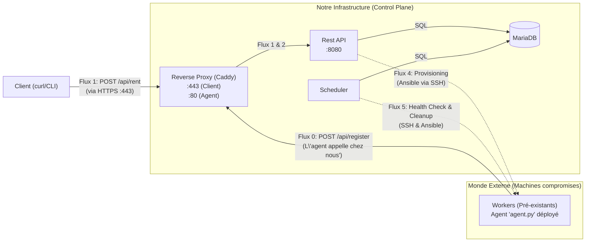

# Projet "Orion-Dynamic" : Orchestrateur de Ressources à Inventaire Dynamique et Gestion de Baux

* **Matière :** Déploiement & Infrastructure as Code (IaC)
* **Objectif :** Simuler une plateforme PaaS où les ressources (conteneurs/machines compromises) **s'enregistrent elles-mêmes** auprès d'un Control Plane. L'orchestrateur doit gérer des locations à **durée déterminée** (baux), garantir la QoS en migrant les clients lors de pannes, et libérer les ressources à l'expiration du bail.

---

## 🎯 Contexte et Objectifs

Le but est de créer un système PaaS où le parc de "nœuds" (workers) est **dynamiquement découvert**. Le scénario simule un ensemble de machines "pré-existantes" (compromises) sur lesquelles un **agent** est déployé.

L'orchestrateur (Control Plane) doit :
1.  **Gérer un inventaire dynamique** : Les workers (via leur agent) contactent l'API pour s'enregistrer (auto-découverte).
2.  **Exposer une API sécurisée** (via un Reverse Proxy) pour les clients désirant louer une ressource pour une **durée spécifique**.
3.  **Surveiller la santé (Health Check)** : Un service `Scheduler` doit activement sonder (via SSH) tous les nœuds *enregistrés* pour connaître leur état ("alive" / "dead").
4.  **Gérer la résilience (Migration) :** En cas de détection de panne d'un nœud loué, le `Scheduler` doit déclencher la migration du client vers un nœud sain, **en conservant la date de fin de bail**.
5.  **Gérer les baux (Expiration) :** Le `Scheduler` doit surveiller les dates de fin de location et déclencher le **dé-provisionnement** (nettoyage) automatique des nœuds dont le bail a expiré.

---

## 🏗️ Architecture Globale

Le système est composé de deux ensembles :

* **Le "Control Plane" (Notre Infrastructure) :** Contient la logique de gestion.
    * `Reverse Proxy` (Caddy) : Point d'entrée pour les clients humains (:443) et les agents (:80).
    * `API` (Python) : Gère les demandes d'enregistrement et de location.
    * `Scheduler` : Gère la surveillance (QoS), la migration et l'expiration des baux.
    * `Database` (MariaDB) : Stocke l'état de l'inventaire et des locations.
* **Le "Data Plane" (Monde Externe) :**
    * `Workers` (Conteneurs Alpine) : Les ressources passives simulées. Exécutent un serveur SSH et un **Agent d'enregistrement**.

---

## 🌐 Schéma Réseau Détaillé (Modèle Dynamique)

Ce schéma illustre le modèle à inventaire dynamique où les agents initient l'enregistrement.

**Explication des flux :**

* **Flux 0 (Enregistrement) :** L'`Agent` sur le Worker contacte `POST /api/register` (via le Proxy) pour s'ajouter à la `Database`.
* **Flux 1 (Location Client) :** Le `Client` envoie `POST /api/rent` (via Proxy) pour louer un nœud pour une durée N.
* **Flux 2 (Proxy Pass) :** Le `Proxy` transfère les requêtes à l'`API`.
* **Flux 3 (État) :** L'`API` et le `Scheduler` lisent/écrivent constamment dans la `Database` (source de vérité).
* **Flux 4 (Provisioning) :** L'`API` (suite à une location) ou le `Scheduler` (suite à une migration) initie une connexion **SSH sortante** pour provisionner un Worker (via Ansible).
* **Flux 5 (QoS / Cleanup) :** Le `Scheduler` initie des connexions **SSH sortantes** pour vérifier la santé (Health Check) ou nettoyer un Worker (Expiration de bail via Ansible).

---

## 🛠️ Fonctionnalités Détaillées

#### 5.1. IaC et Déploiement
* Un `docker-compose.yml` déploie le "Control Plane" (Proxy, API, Scheduler, DB).
* Un script (`launch_workers.sh`) et un `Dockerfile` déploient le "Data Plane" (les `Workers` Alpine + Agent).

#### 5.2. Agent Worker (`agent.py`)
* **Au démarrage,** l'agent s'exécute en tâche de fond.
* Il lit ses variables d'environnement (`MY_HOST_PORT`, `API_ENDPOINT`).
* Il envoie `POST /api/register` avec `{"hostname": "host.docker.internal", "ssh_port": 22221}`.
* Il gère les réessais en cas d'échec (si le Control Plane n'est pas prêt).

#### 5.3. API (Python)
* **`POST /api/workers/register` :** (Appelé par l'Agent)
    1.  Reçoit le `hostname` et le `ssh_port`.
    2.  Exécute `INSERT ... ON DUPLICATE KEY UPDATE` pour ajouter/mettre à jour le nœud dans la table `nodes`.
    3.  Met le `status` à 'unknown' (le Scheduler validera).
* **`POST /api/rent` :** (Appelé par le Client, via Proxy HTTPS)
    1.  Prend en entrée `{"client_id": "...", "duration_hours": 2}`.
    2.  Interroge la `DB` pour trouver un `Worker` avec `status = 'alive'` ET `allocated = false`.
    3.  Si aucun n'est trouvé, renvoie 503 (Service Unavailable).
    4.  Calcule `lease_end = NOW() + duration_hours`.
    5.  Marque le Worker comme `allocated = true`, `allocated_to = '...'`, `lease_end_at = [lease_end]` dans la DB.
    6.  Appelle **Ansible** (Flux 4) pour provisionner ce Worker.
    7.  Renvoie les détails de connexion au client.

#### 5.4. Scheduler - La QoS et la Gestion des Baux
* **Tâche 1 : Health Check (Toutes les 30s)**
    1.  Exécute `SELECT * FROM nodes`.
    2.  Pour chaque Worker, tente une connexion SSH (Flux 5).
    3.  Si succès : `UPDATE nodes SET status = 'alive', last_checked = NOW()`.
    4.  Si échec : `UPDATE nodes SET status = 'dead', last_checked = NOW()`.
* **Tâche 2 : Migration (Toutes les 10s)**
    1.  Cherche les `Workers` avec `status = 'dead'` ET `allocated = true`.
    2.  Pour chaque cas (une "panne client") :
        a. Sauvegarde les infos du client (`allocated_to`, `lease_end_at`).
        b. Trouve un *nouveau* Worker (`status = 'alive'`, `allocated = false`).
        c. Si pas de nouveau Worker dispo, log l'erreur (client en panne).
        d. Si trouvé :
            i. Appelle **Ansible** (Flux 4) pour provisionner le *nouveau* Worker.
            ii. Met à jour la DB (ancienne location libérée, nouvelle créée avec le même `lease_end_at`).
* **Tâche 3 : Expiration des Baux (Toutes les minutes)**
    1.  Cherche les `Workers` avec `allocated = true` ET `lease_end_at <= NOW()`.
    2.  Pour chaque cas (un "bail expiré") :
        a. Appelle **Ansible** (Flux 5) pour **dé-provisionner** le Worker (ex: `delete_user.yml`).
        b. Met à jour la DB : `UPDATE nodes SET allocated = FALSE, allocated_to = NULL, lease_end_at = NULL`.

---

## 📦 Livrables Attendus

1.  **Code Source :** Le code Python pour l'API, le Scheduler, et l'Agent.
2.  **Fichiers IaC :**
    * `docker-compose.yml` (Control Plane).
    * `Dockerfile` pour l'API (Python, Ansible).
    * `Dockerfile` pour le Scheduler (Python, Ansible, Paramiko).
    * `Dockerfile` pour le Worker (Alpine, `openssh-server`, Python, Agent).
    * `Caddyfile` pour le Proxy.
    * `init.sql` pour la structure de la DB.
3.  **Scripts d'Automatisation :**
    * Playbooks Ansible (ex: `create_user.yml`, `delete_user.yml`).
    * Script de lancement des Workers (`launch_workers.sh`) et de l'agent (`entrypoint.sh`).
4.  **Documentation :** Un `README.md` (ce fichier) expliquant l'architecture, comment lancer le Control Plane et simuler le Data Plane.
