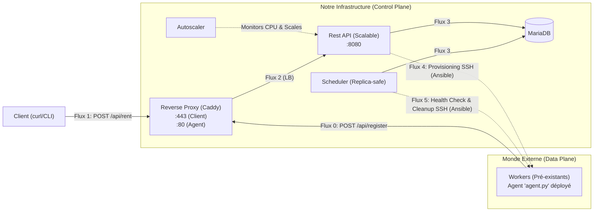

# Projet "Orion-Dynamic" : Orchestrateur de Ressources à Inventaire Dynamique et Gestion de Baux

* **Matière :** Déploiement & Infrastructure as Code (IaC)  
* **Objectif :** Plateforme PaaS simulant un parc de ressources “auto-enregistrantes”, avec gestion des baux, migration en cas de panne et dé-provisionnement automatique à l’expiration.

---

## Contexte et Objectifs

Le Control Plane doit :

1. **Découvrir dynamiquement les Workers** via un Agent qui s’enregistre sur l’API.  
2. **Exposer une API sécurisée** pour louer des ressources pour une durée déterminée.  
3. **Surveiller la santé des nœuds** avec un Scheduler qui fait du SSH pour déterminer leur état.  
4. **Migrer automatiquement les clients** si un nœud tombe en panne.  
5. **Libérer et nettoyer les nœuds** à l’expiration du bail.

---

## Architecture

**Control Plane :**

- Reverse Proxy (Caddy, HTTPS client / HTTP agent, Load Balancing)
- API Python (gestion enregistrement + location, scalable)
- Autoscaler (Monitoring CPU + Scaling Docker)
- Scheduler (Health Check, Migration, Expiration, Concurrency safety)
- MariaDB (DB inventaire + baux)

**Data Plane :**

- Workers (containers Alpine avec SSH + Agent Python)

---

## Schéma Flux (Mermaid)


**Explication des flux :**

* **Flux 0 (Enregistrement) :** L'`Agent` sur le Worker contacte `POST /api/register` (via le Proxy) pour s'ajouter à la `Database`.
* **Flux 1 (Location Client) :** Le `Client` envoie `POST /api/rent` (via Proxy) pour louer un nœud pour une durée N.
* **Flux 2 (Proxy Pass) :** Le `Proxy` transfère les requêtes à l'`API`.
* **Flux 3 (État) :** L'`API` et le `Scheduler` lisent/écrivent constamment dans la `Database` (source de vérité).
* **Flux 4 (Provisioning) :** L'`API` (suite à une location) ou le `Scheduler` (suite à une migration) initie une connexion **SSH sortante** pour provisionner un Worker (via Ansible).
* **Flux 5 (QoS / Cleanup) :** Le `Scheduler` initie des connexions **SSH sortantes** pour vérifier la santé (Health Check) ou nettoyer un Worker (Expiration de bail via Ansible).

---

## 🛠️ Fonctionnalités

### 1. Agent (`agent.py`)
- Envoie `hostname`, `ip`, `ssh_port` au Control Plane via `POST /api/workers/register`.  
- Exception Docker : si IP interne `172.17.*`, utiliser `host.docker.internal`.  
- Gère les retries.

### 2. API
#### `POST /api/workers/register`
- Ajoute/Met à jour un Worker (`hostname`, `ip`, `ssh_port`, `status='unknown'`).  

#### `POST /api/rent`
- Input : `duration_hours`, `count`, optionnel `ssh_password`.  
- Vérifie nœuds `alive` et `allocated = FALSE`.  
- Calcule `lease_end`.  
- Met `allocated = TRUE` et `allocated_to = user`.  
- Provision via Ansible (`create_user.yml`).  
- Retourne `host_ip`, `ssh_port`, `client_user`, `client_pass`, `leased_until`.  

### 3. Scheduler
#### Health Check (30s)
- **Concurrence** : Utilise `SELECT ... FOR UPDATE SKIP LOCKED` pour permettre à plusieurs instance de Scheduler de travailler en parallèle sans conflit.
- SSH sur tous les Workers.  
- MAJ `status` (`alive`/`dead`), `last_checked`.  

#### Migration (10s)
- Nœuds `dead` et `allocated = TRUE` → trouver nouveau Worker `alive`.  
- Provisionner via Ansible, mettre à jour DB.  

#### Expiration des baux (1min)
- Nœuds `allocated = TRUE` et `lease_end <= NOW()`.  
- Dé-provision via Ansible (`delete_user.yml`).  
- Libération DB (`allocated = FALSE`, `allocated_to = NULL`, `lease_end_at = NULL`).

### 4. Autoscaler
- **Monitoring** : Vérifie la charge CPU de tous les conteneurs API toutes les 5s.
- **Scaling UP** : Si charge > 70%, ajoute un réplica (max 5).
- **Scaling DOWN** : Si charge < 20%, retire un réplica (min 2).
- **Action** : Utilise la commande `docker compose up --scale` à chaud.

---

## 📦 Livrables

1. **Code Python** : API, Scheduler, Agent.  
2. **IaC** : `docker-compose.yml`, `Dockerfile` pour API, Scheduler, Worker, Caddyfile.  
3. **Playbooks Ansible** : `create_user.yml`, `delete_user.yml`.  
4. **Scripts** : lancement des Workers (`launch_workers.sh`).  
5. **DB** : `init.sql` (tables `nodes`, `users`, `rentals`).  
6. **Documentation** : `README.md`.

---

### Remarques

- Le rôle admin peut être défini avec :

```sql
UPDATE users SET role='admin' WHERE username='admin';
```
- Les IP Docker sont remplacées par host.docker.internal pour que l’API/SSH fonctionne depuis le Control Plane.

- allocated est toujours mis à TRUE lors d’une location pour éviter les conflits.

- La structure DB comprend maintenant ip pour les Workers.